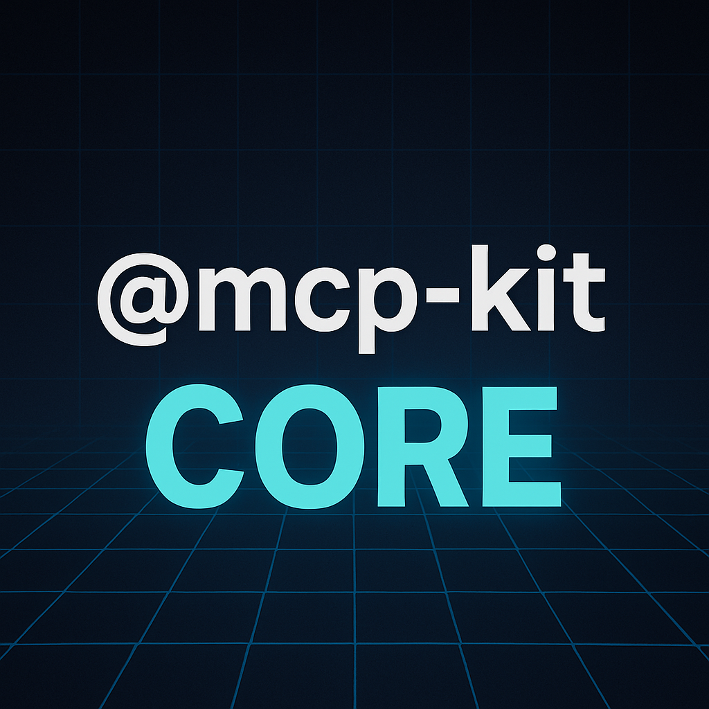

# @mcp-kit/core



Lightweight, production-ready MCP server toolkit for modern runtimes. Build tools, prompts, and resources once — run anywhere (Deno, Bun, Node via HTTP fetch).

## Why this kit

- Simple: one server, one `fetch` handler
- Portable: edge-first, Node-free public API for JSR
- Batteries included: tools, prompts, resources (with templates)

## Model Context Protocol coverage

The table below summarizes which parts of the official MCP spec (2025-06-18) this kit implements.

| Status | Description                         |        |
| ------ | ----------------------------------- | ------ |
| ✅     | JSON-RPC 2.0 envelope               | Server |
| ✅     | initialize                          | Server |
| ✅     | ping                                | Server |
| ✅     | Tools: tools/list                   | Server |
| ✅     | Tools: tools/call                   | Server |
| ✅     | Prompts: prompts/list               | Server |
| ✅     | Prompts: prompts/get                | Server |
| ✅     | Resources: resources/list           | Server |
| ✅     | Resources: resources/read           | Server |
| ✅     | Resources: resources/templates/list | Server |
| ✅     | Canonical tools: search             | Server |
| ✅     | Canonical tools: fetch              | Server |
| ✅     | HTTP transport (fetch)              | Server |
| ✅     | STDIO transport                     | Server |
| ✅     | Auth (HTTP OAuth 2.1)               | Server |
| ✅     | Auth (STDIO env)                    | Server |
| ✅     | OAuth 2.1 discovery                 | Server |
| ✅     | Event sink/observability            | Server |
| ⬜️     | Streaming tool outputs              | Server |
| ⬜️     | Search/list roots                   | Client |
| ⬜️     | Messages API                        | Client |
| ⬜️     | Sampling / model / session          | Client |

## Install

Deno (JSR):

```ts
import { MCPServer } from "jsr:@mcp-kit/core";
```

Bun / Node (via JSR):

```bash
npx jsr add @mcp-kit/core
```

```ts
import { MCPServer } from "@mcp-kit/core";
```

## Quick start (Tools + HTTP fetch)

Deno:

```ts
import { MCPServer, type MCPToolkit } from "jsr:@mcp-kit/core";
import z from "zod";

const helloInputSchema = z.object({ name: z.string().min(1) });
const helloOutputSchema = z.object({ message: z.string() });

const helloToolkit: MCPToolkit = {
  namespace: "hello",
  tools: [
    {
      name: "hello_say",
      description: "Say hello to a name",
      input: { zod: helloInputSchema },
      output: { zod: helloOutputSchema },
      execute: async ({ name }) => ({
        content: [{ type: "text", text: `Hello, ${name}!` }],
        structuredContent: { message: `Hello, ${name}!` },
      }),
    },
  ],
};

const server = new MCPServer({ toolkits: [helloToolkit] });
Deno.serve((req) => server.fetch(req));
```

Bun:

```ts
import { MCPServer, type MCPToolkit } from "@mcp-kit/core";
import z from "zod";

const helloInputSchema = z.object({ name: z.string().min(1) });
const helloOutputSchema = z.object({ message: z.string() });

const helloToolkit: MCPToolkit = {
  namespace: "hello",
  tools: [
    {
      name: "hello_say",
      description: "Say hello to a name",
      input: { zod: helloInputSchema },
      output: { zod: helloOutputSchema },
      execute: async ({ name }) => ({
        content: [{ type: "text", text: `Hello, ${name}!` }],
        structuredContent: { message: `Hello, ${name}!` },
      }),
    },
  ],
};

const server = new MCPServer({ toolkits: [helloToolkit] });
Bun.serve({ port: 8000, fetch: (req) => server.fetch(req) });
```

Test with curl:

```bash
curl -s -X POST http://localhost:8000 \
  -H 'Content-Type: application/json' \
  -d '{
    "jsonrpc":"2.0", "id":1, "method":"tools/call",
    "params": { "name":"hello_say", "arguments": { "name":"Ada" } }
  }'
```

## Add a Prompt (optional)

```ts
import { MCPServer, type MCPToolkit } from "jsr:@mcp-kit/core";

const promptsToolkit: MCPToolkit = {
  namespace: "prompts",
  prompts: [
    {
      name: "greeter",
      title: "Greeter system prompt",
      messages: [
        { role: "system", content: { type: "text", text: "You are a concise assistant." } },
      ],
    },
  ],
};

const server = new MCPServer({ toolkits: [promptsToolkit] });
Deno.serve((req) => server.fetch(req));
```

## Add Resource Templates (optional)

```ts
import { createMCPResourceTemplateProvider, MCPServer, type MCPToolkit } from "jsr:@mcp-kit/core";

const templates = createMCPResourceTemplateProvider({
  // task://{id} → render a single task
  templateId: "task",
  uriTemplate: "task://{id}",
  provide: async ({ id }) => ({
    contents: [{
      uri: `task://${id}`,
      name: `Task ${id}`,
      mimeType: "application/json",
      text: JSON.stringify({ id, title: `Task ${id}` }),
    }],
  }),
});

const resourcesToolkit: MCPToolkit = {
  namespace: "resources",
  resourceTemplates: [templates],
};

const server = new MCPServer({ toolkits: [resourcesToolkit] });
Deno.serve((req) => server.fetch(req));
```

## Runtime notes

- Edge-first: JSR export uses the edge/Deno entry. Use HTTP fetch; STDIO is Node-only.
- Import paths: use explicit `.ts` in your own code for Deno projects.

## License

MIT

---

<p align="center">
  
  &nbsp;&nbsp;&nbsp;&nbsp;
  
  <br/>
</p>
